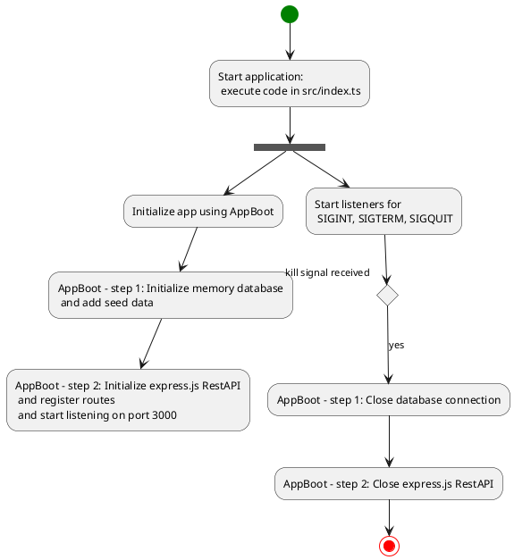

# Starting app flow

```puml
@startuml

(*)#green --> "Start application:\n execute code in src/index.ts"
--> ===Start_Listeners===

--> "Initialize app using AppBoot"
--> "AppBoot - step 1: Initialize memory database\n and add seed data"
--> "AppBoot - step 2: Initialize express.js RestAPI\n and register routes\n and start listening on port 3000"


===Start_Listeners=== --> "Start listeners for\n SIGINT, SIGTERM, SIGQUIT" as listenToKillSignals

if "kill signal received" then
	--> [yes] "AppBoot - step 1: Close database connection"
	--> "AppBoot - step 2: Close express.js RestAPI"
	--> (*) #red
endif

@enduml
```
